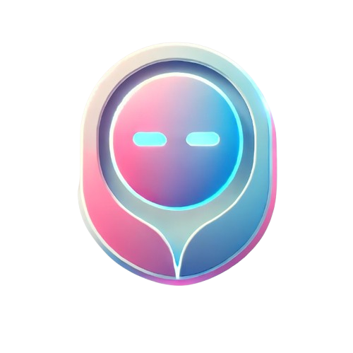

# NEXA - Virtual Assistant  

  

## 📌 Overview  
NEXA is a virtual assistant built using **HTML, CSS, and JavaScript**. It provides **voice recognition** and **text-to-speech** capabilities, making it an interactive and user-friendly assistant for various tasks.  

## ✨ Features  
- 🎤 **Voice Recognition**: Accepts user voice commands using speech recognition.  
- 🔊 **Text-to-Speech**: Converts text responses into speech.  
- 🎨 **User-Friendly UI**: Stylish interface with smooth animations.  
- 🌐 **Web-Based**: No installations needed, runs directly in the browser.  

## 🚀 Technologies Used  
- **HTML** - Structure of the web application  
- **CSS** - Styling and animations  
- **JavaScript** - Core logic for speech recognition and response  

## 📂 Project Structure  
📁 NEXA-Virtual-Assistant
├── 📜 index.html # Main interface
├── 🎨 style.css # Styling file
├── 🎤 script.js # JavaScript functionality
├── 🖼️ logo.png # Application logo
├── 🖼️ bg_img.jpg # Background image
├── 🎵 mic.svg # Microphone icon
├── 🎬 voice.gif # Animation for voice interaction
├── 🎬 voice-2.gif # Alternate animation
├── 🎬 a-2.gif # Additional assets
├── 📜 README.md # Project documentation

## 🔧 Setup & Usage  
1. Clone the repository:  
   ```bash
   git clone https://github.com/Shivam0400/NEXA-Virtual-Assistant.git
2. Open index.html in any web browser.
3. Click on the microphone icon and start giving voice commands.
## 🎯 Future Enhancements
Add AI-powered responses using OpenAI API.
Improve speech accuracy with NLP techniques.
Create a mobile-friendly version.
## 💡 Contribution
Feel free to fork this project, raise issues, and submit pull requests.
